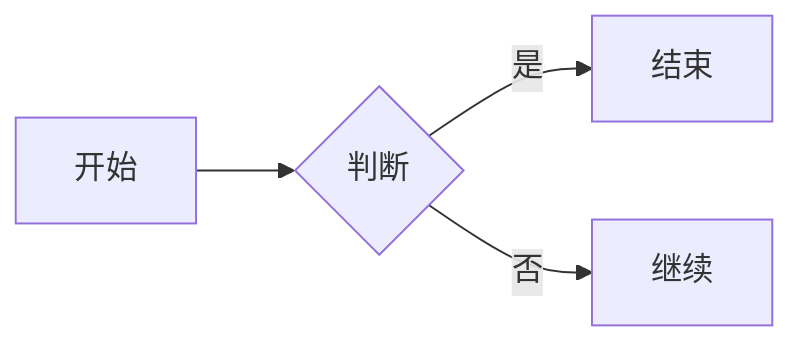

# 技术文档项目集

这里是技术方案、架构设计、API 文档的统一管理仓库。

## 📚 项目列表

### 🏗️ 架构设计

| 项目 | 描述 | 在线文档 | 状态 |
|------|------|----------|------|
| [Stripe Billing](./stripe-billing/) | 订阅和周期账单系统接入方案 | [查看文档](https://lzf-io.github.io/project/stripe-billing/) | ✅ 已完成 |
| 微服务架构 | 微服务拆分和治理方案 | - | 📝 规划中 |
| API 网关 | 统一接入层设计 | - | 📝 规划中 |

### 🔌 API 文档

| 项目 | 描述 | 在线文档 | 状态 |
|------|------|----------|------|
| REST API | RESTful API 设计规范 | - | 📝 规划中 |

### 📖 运维指南

| 项目 | 描述 | 在线文档 | 状态 |
|------|------|----------|------|
| 部署手册 | 应用部署和运维指南 | - | 📝 规划中 |

## 🚀 如何添加新项目

### 1. 创建项目目录

```bash
cd ~/Desktop/myclaw/project
mkdir my-new-project
cd my-new-project
```

### 2. 初始化 MkDocs

```bash
# 创建目录结构
mkdir -p docs .github/workflows

# 复制模板
cp ../stripe-billing/mkdocs.yml .
cp ../stripe-billing/.github/workflows/deploy.yml .github/workflows/
cp ../stripe-billing/.gitignore .
```

### 3. 编辑配置

修改 `mkdocs.yml` 中的 `site_name` 和导航结构。

### 4. 更新总 README

在本文件（`README.md`）的项目列表中添加新项目信息。

### 5. 提交推送

```bash
git add .
git commit -m "添加新项目：xxx"
git push
```

## 🛠️ 工具链

- **编辑器：** IntelliJ IDEA（支持 Markdown 实时预览）
- **文档生成：** MkDocs Material
- **图表工具：** Mermaid（代码即文档）
- **版本控制：** Git + GitHub
- **自动部署：** GitHub Actions → GitHub Pages

## 📝 写作规范

### 文档结构

```
project-name/
├── docs/
│   ├── index.md            # 首页
│   ├── architecture/       # 架构设计
│   ├── api/               # API 文档
│   └── guides/            # 使用指南
├── mkdocs.yml             # 配置文件
└── README.md              # 项目说明
```

### Markdown 规范

- 使用 ATX 风格标题（`#` 开头）
- 代码块必须指定语言
- 图表优先使用 Mermaid
- 重要提示使用 Admonition

### Mermaid 图表示例



## 🔗 相关链接

- **在线文档：** https://lzf-io.github.io/project/
- **GitHub 仓库：** https://github.com/lzf-io/project
- **MkDocs 文档：** https://squidfunk.github.io/mkdocs-material/

## 📧 联系方式

- **维护者：** zhengfang
- **GitHub：** [@lzf-io](https://github.com/lzf-io)

---

**最后更新：** 2026-03-12
