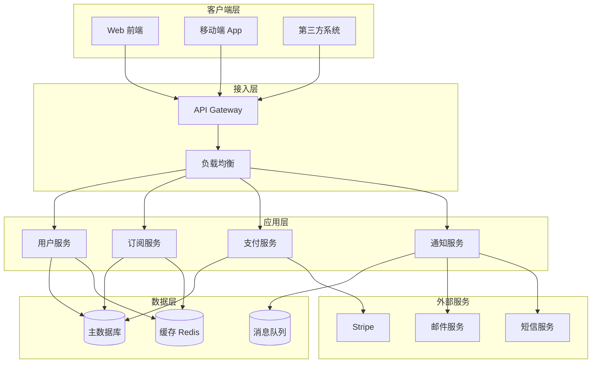

# 架构概览

## 系统整体架构

## 技术栈

### 后端
- **语言：** Java 17
- **框架：** Spring Boot 3.x
- **数据库：** MySQL 8.0
- **缓存：** Redis 7.x
- **消息队列：** RabbitMQ / Kafka

### 前端
- **框架：** React 18 / Vue 3
- **UI 库：** Ant Design / Element Plus
- **状态管理：** Redux / Pinia

### 基础设施
- **容器化：** Docker + Kubernetes
- **CI/CD：** GitHub Actions / GitLab CI
- **监控：** Prometheus + Grafana
- **日志：** ELK Stack

## 设计原则

!!! success "核心原则"
    - 高可用：服务无单点故障
    - 可扩展：支持水平扩展
    - 安全性：数据加密、权限控制
    - 可观测：全链路监控和日志

---

**最后更新：** 2026-03-12
