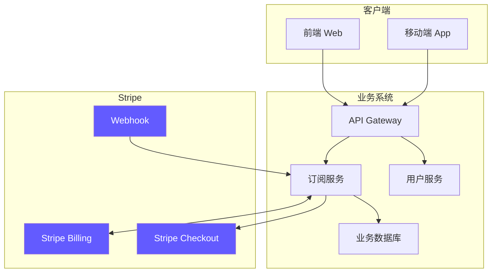
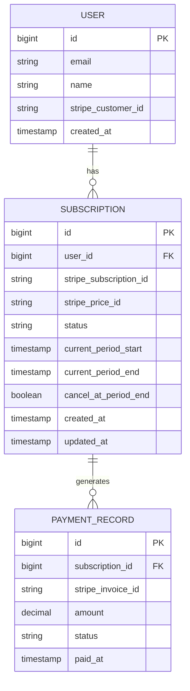
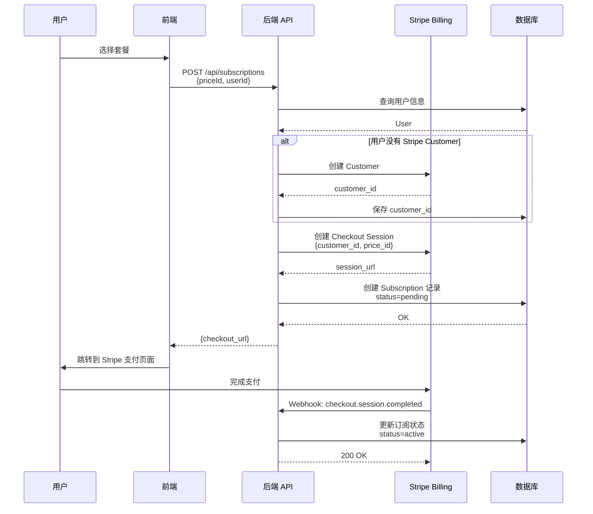
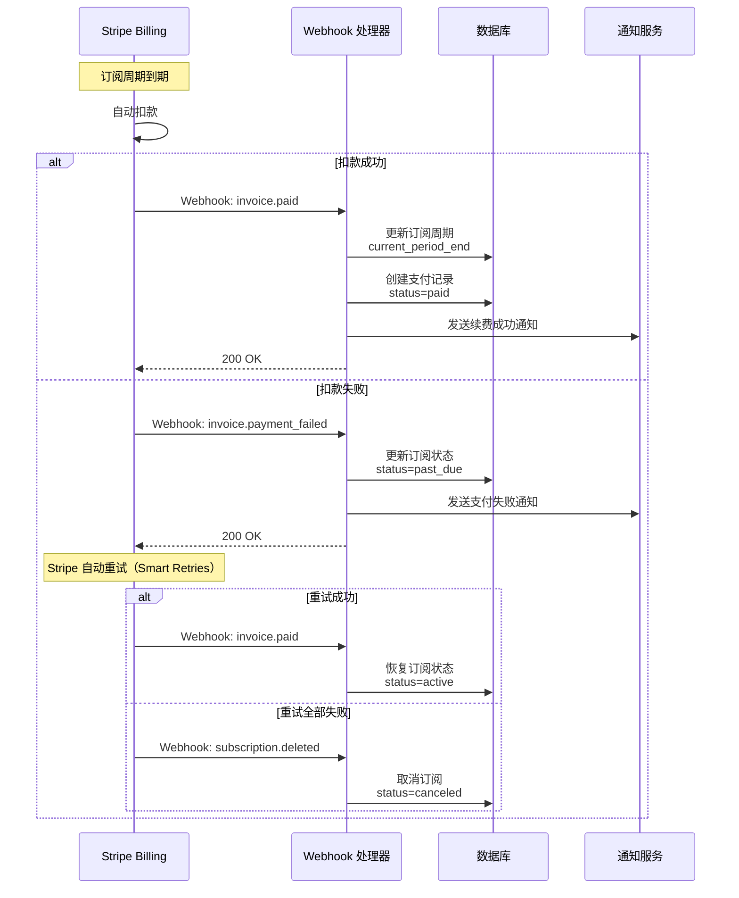
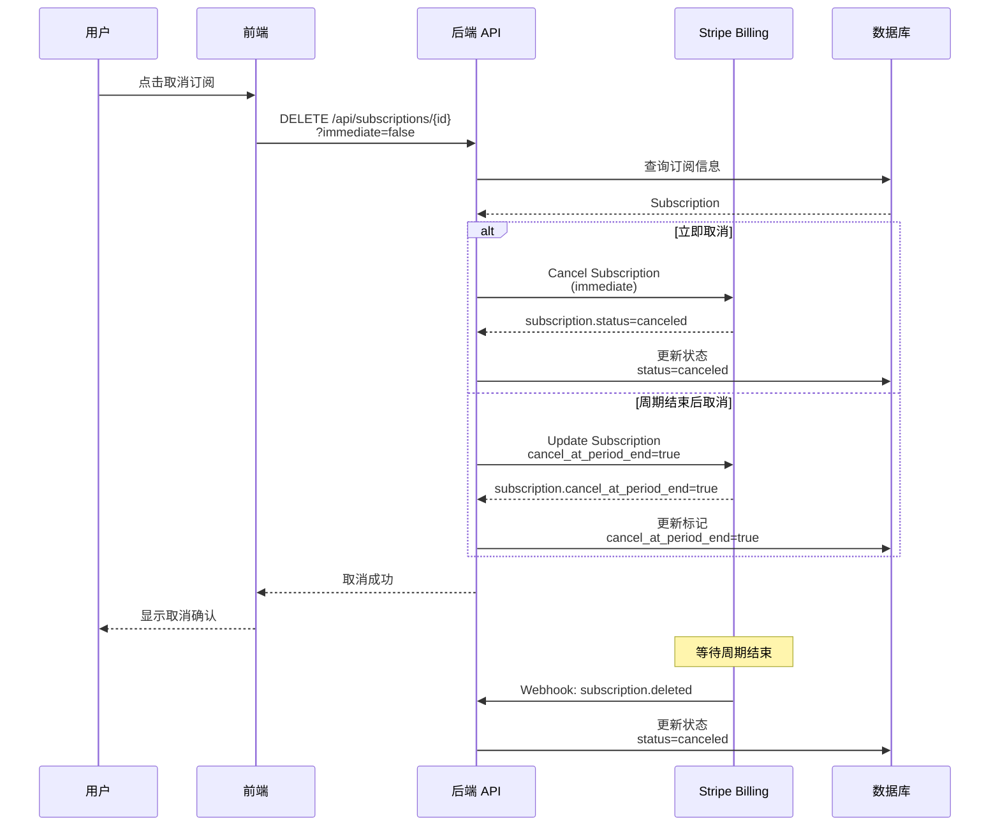
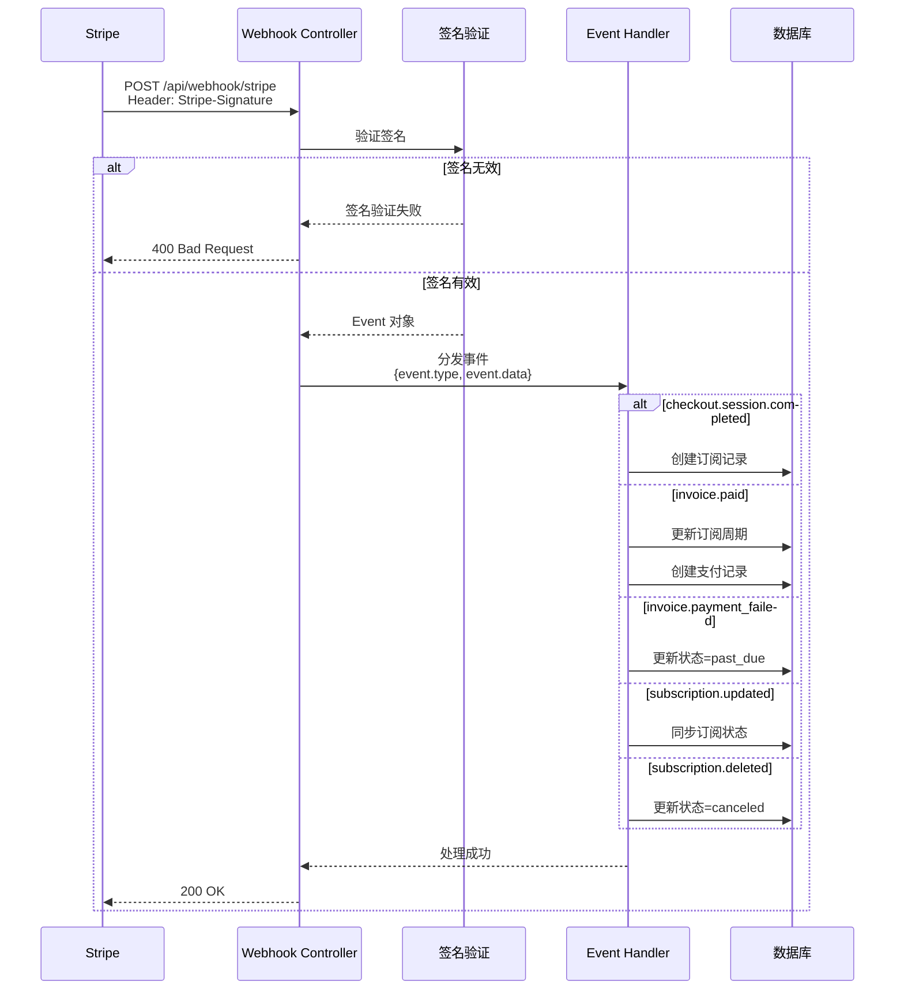
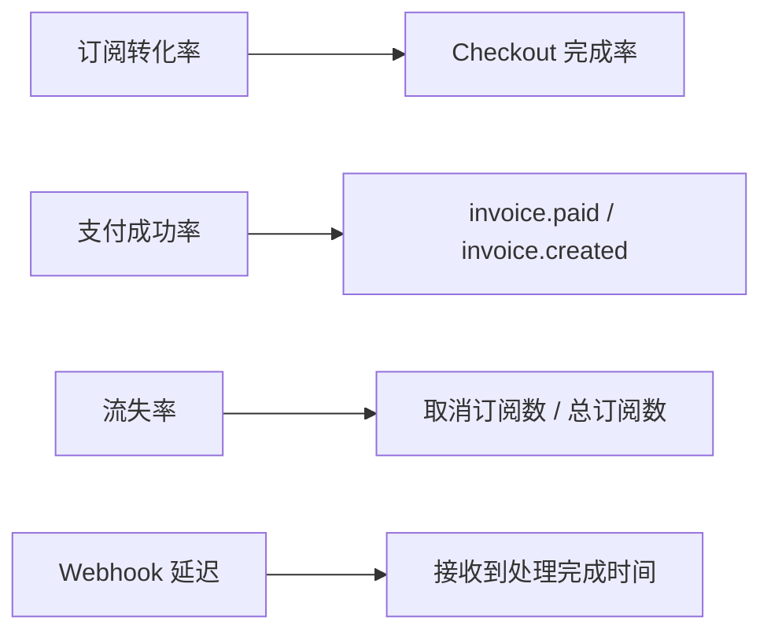

# Stripe Billing 接入方案

**项目：** 订阅和周期账单系统  
**当前状态：** 自建账单管理 + Stripe 支付  
**目标：** 迁移到 Stripe Billing  
**日期：** 2026-03-11  
**架构师：** zhengfang

---

## 📊 核心概念对比

### 当前方案（自建）
- 自己维护订阅状态、周期、计费逻辑
- 调用 Stripe Payment API 完成扣款
- 需要处理：续费提醒、账单生成、失败重试等

### Stripe Billing 方案
- Stripe 托管订阅生命周期
- 自动处理周期扣款、重试、发票生成
- Webhook 通知业务系统同步状态

!!! success "优势"
    - ✅ 减少自建逻辑，降低维护成本
    - ✅ 自动处理失败重试、Dunning（催款）
    - ✅ 内置发票、税务、多币种支持
    - ✅ 更好的合规性（PCI DSS）

---

## 🏗️ 架构设计

### 整体架构



### 数据模型



---

## 🔄 核心流程

### 1. 用户创建订阅流程



### 2. 周期扣款流程（自动）



### 3. 用户取消订阅流程



### 4. Webhook 事件处理流程



---

## 🛠️ 技术实现

### Maven 依赖

```xml
<dependency>
    <groupId>com.stripe</groupId>
    <artifactId>stripe-java</artifactId>
    <version>24.14.0</version>
</dependency>
```

### 配置文件

```yaml title="application.yml"
stripe:
  api-key: ${STRIPE_SECRET_KEY}
  webhook-secret: ${STRIPE_WEBHOOK_SECRET}
  price-ids:
    basic-monthly: price_xxxxxxxxxxxxx
    basic-yearly: price_yyyyyyyyyyyyy
    pro-monthly: price_zzzzzzzzzzzzz
```

### 核心代码结构

```
src/main/java/com/example/billing/
├── config/
│   └── StripeConfig.java              # Stripe 客户端配置
├── controller/
│   ├── SubscriptionController.java    # 订阅 API
│   └── StripeWebhookController.java   # Webhook 接收
├── service/
│   ├── StripeCustomerService.java     # Customer 管理
│   ├── SubscriptionService.java       # 订阅业务逻辑
│   └── WebhookEventHandler.java       # Webhook 事件处理
├── entity/
│   ├── User.java
│   ├── Subscription.java
│   └── PaymentRecord.java
└── dto/
    ├── CreateSubscriptionRequest.java
    └── SubscriptionResponse.java
```

---

## 📝 核心 API 实现

### 1. 创建订阅（Checkout Session）

```java title="SubscriptionService.java"
@Service
public class SubscriptionService {
    
    @Value("${stripe.api-key}")
    private String apiKey;
    
    public String createCheckoutSession(Long userId, String priceId) throws StripeException {
        Stripe.apiKey = apiKey;
        
        // 1. 获取或创建 Stripe Customer
        User user = userRepository.findById(userId).orElseThrow();
        String customerId = getOrCreateCustomer(user);
        
        // 2. 创建 Checkout Session
        SessionCreateParams params = SessionCreateParams.builder()
            .setMode(SessionCreateParams.Mode.SUBSCRIPTION)
            .setCustomer(customerId)
            .addLineItem(
                SessionCreateParams.LineItem.builder()
                    .setPrice(priceId)
                    .setQuantity(1L)
                    .build()
            )
            .setSuccessUrl("https://yourdomain.com/success?session_id={CHECKOUT_SESSION_ID}")
            .setCancelUrl("https://yourdomain.com/cancel")
            .build();
        
        Session session = Session.create(params);
        
        // 3. 保存临时记录
        Subscription subscription = new Subscription();
        subscription.setUserId(userId);
        subscription.setStatus("pending");
        subscription.setStripePriceId(priceId);
        subscriptionRepository.save(subscription);
        
        return session.getUrl();
    }
    
    private String getOrCreateCustomer(User user) throws StripeException {
        if (user.getStripeCustomerId() != null) {
            return user.getStripeCustomerId();
        }
        
        CustomerCreateParams params = CustomerCreateParams.builder()
            .setEmail(user.getEmail())
            .setName(user.getName())
            .putMetadata("user_id", String.valueOf(user.getId()))
            .build();
        
        Customer customer = Customer.create(params);
        user.setStripeCustomerId(customer.getId());
        userRepository.save(user);
        
        return customer.getId();
    }
}
```

### 2. Webhook 处理

```java title="StripeWebhookController.java"
@RestController
@RequestMapping("/api/webhook")
public class StripeWebhookController {
    
    @Value("${stripe.webhook-secret}")
    private String webhookSecret;
    
    @Autowired
    private WebhookEventHandler eventHandler;
    
    @PostMapping("/stripe")
    public ResponseEntity<String> handleWebhook(
            @RequestBody String payload,
            @RequestHeader("Stripe-Signature") String sigHeader) {
        
        Event event;
        try {
            // 验证签名
            event = Webhook.constructEvent(payload, sigHeader, webhookSecret);
        } catch (SignatureVerificationException e) {
            log.error("Webhook signature verification failed", e);
            return ResponseEntity.status(400).body("Invalid signature");
        }
        
        // 处理事件
        try {
            eventHandler.handle(event);
        } catch (Exception e) {
            log.error("Error handling webhook event: {}", event.getType(), e);
            // 返回 200 避免 Stripe 重试（已记录错误，手动处理）
        }
        
        return ResponseEntity.ok("Received");
    }
}
```

### 3. Webhook 事件处理器

```java title="WebhookEventHandler.java"
@Service
public class WebhookEventHandler {
    
    @Autowired
    private SubscriptionRepository subscriptionRepository;
    
    public void handle(Event event) {
        switch (event.getType()) {
            case "checkout.session.completed":
                handleCheckoutCompleted(event);
                break;
            case "invoice.paid":
                handleInvoicePaid(event);
                break;
            case "invoice.payment_failed":
                handlePaymentFailed(event);
                break;
            case "customer.subscription.updated":
                handleSubscriptionUpdated(event);
                break;
            case "customer.subscription.deleted":
                handleSubscriptionDeleted(event);
                break;
            default:
                log.info("Unhandled event type: {}", event.getType());
        }
    }
    
    private void handleCheckoutCompleted(Event event) {
        Session session = (Session) event.getDataObjectDeserializer()
            .getObject().orElseThrow();
        
        String subscriptionId = session.getSubscription();
        
        // 获取完整订阅信息并更新本地数据库
        // ... 详细实现
        
        log.info("Subscription created: {}", subscriptionId);
    }
    
    private void handleInvoicePaid(Event event) {
        Invoice invoice = (Invoice) event.getDataObjectDeserializer()
            .getObject().orElseThrow();
        
        // 更新订阅周期和支付记录
        // ... 详细实现
        
        log.info("Invoice paid: {}", invoice.getId());
    }
    
    // ... 其他事件处理方法
}
```

---

## 🔒 安全注意事项

!!! danger "重要安全措施"
    以下措施必须严格执行：

### 1. Webhook 签名验证
```java
// 必须验证 Stripe-Signature 头
Event event = Webhook.constructEvent(payload, sigHeader, webhookSecret);
```

!!! warning "警告"
    未经验证的 Webhook 可能导致数据篡改和安全风险！

### 2. API Key 管理
- ⚠️ **不要**将 API Key 硬编码在代码中
- ✅ 使用环境变量或密钥管理服务（AWS Secrets Manager、Vault）
- ✅ 区分测试环境（`sk_test_`）和生产环境（`sk_live_`）

### 3. 幂等性处理
```java
// Webhook 可能重复发送，需要保证幂等性
@Transactional
public void handleInvoicePaid(Invoice invoice) {
    // 检查是否已处理
    if (paymentRecordRepository.existsByStripeInvoiceId(invoice.getId())) {
        log.info("Invoice already processed: {}", invoice.getId());
        return;
    }
    // ... 处理逻辑
}
```

---

## 📋 迁移步骤

### Phase 1: 准备阶段（1-2天）
- [x] 在 Stripe Dashboard 创建产品和价格（Product & Prices）
- [x] 配置 Webhook 端点（测试环境）
- [x] 添加 Stripe Java SDK 依赖
- [x] 设计新的数据库表结构

### Phase 2: 开发阶段（1周）
- [x] 实现 Customer 管理
- [x] 实现 Checkout Session 创建
- [x] 实现 Webhook 处理器
- [x] 实现订阅管理 API（查询、取消、升降级）
- [ ] 编写单元测试和集成测试

### Phase 3: 测试阶段（3-5天）
- [ ] 使用 Stripe 测试卡进行端到端测试
- [ ] 测试各种场景：成功订阅、支付失败、取消订阅、周期续费
- [ ] Webhook 重放测试（Stripe CLI）
- [ ] 负载测试

### Phase 4: 灰度上线（1周）
- [ ] 新用户使用 Stripe Billing
- [ ] 老用户继续使用旧系统
- [ ] 监控 Webhook 处理成功率
- [ ] 收集用户反馈

### Phase 5: 全量迁移（2-3周）
- [ ] 编写数据迁移脚本（老订阅 → Stripe Subscription）
- [ ] 分批迁移老用户数据
- [ ] 下线旧的账单系统
- [ ] 监控和优化

---

## 🧪 测试工具

### Stripe CLI
```bash
# 安装 Stripe CLI
brew install stripe/stripe-cli/stripe

# 登录
stripe login

# 转发 Webhook 到本地
stripe listen --forward-to localhost:8080/api/webhook/stripe

# 触发测试事件
stripe trigger checkout.session.completed
stripe trigger invoice.paid
```

### 测试卡号
| 场景 | 卡号 | 过期日期 | CVV |
|------|------|----------|-----|
| 成功 | 4242 4242 4242 4242 | 任意未来日期 | 任意3位数 |
| 需要 3D 验证 | 4000 0025 0000 3155 | 任意未来日期 | 任意3位数 |
| 失败 | 4000 0000 0000 0002 | 任意未来日期 | 任意3位数 |

---

## 📊 监控指标

### 关键指标


!!! tip "监控建议"
    - 设置告警阈值：Webhook 延迟 > 5s
    - 定期检查 Webhook 失败日志
    - 监控 Stripe Dashboard 中的 Smart Retries 成功率

---

## 💰 成本优化建议

1. **使用 Stripe Billing Portal**
   - 让用户自助管理订阅（升降级、更新支付方式）
   - 减少客服工作量

2. **配置合理的 Dunning 策略**
   - 避免过早取消订阅
   - 提高续费成功率

3. **使用 Stripe Sigma**（付费功能）
   - 深度分析订阅数据
   - 发现优化点

---

## 📚 参考资源

- [Stripe Billing 官方文档](https://stripe.com/docs/billing)
- [Stripe Java SDK](https://github.com/stripe/stripe-java)
- [Webhook 最佳实践](https://stripe.com/docs/webhooks/best-practices)
- [测试指南](https://stripe.com/docs/testing)

---

**文档版本：** 1.0  
**最后更新：** 2026-03-12  
**维护人：** zhengfang
