# 核心流程设计

## 1. 产品创建流程

### 1.1 创建实物产品

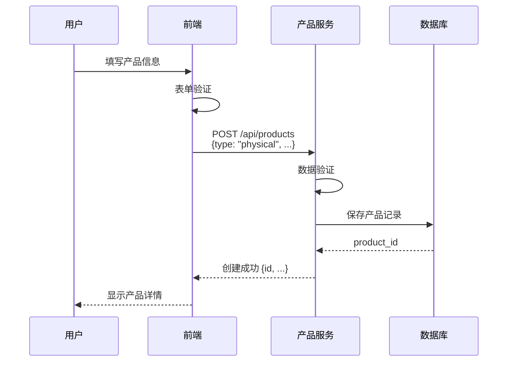
```mermaid
sequenceDiagram
    participant U as 用户
    participant F as 前端
    participant P as 产品服务
    participant DB as 数据库
    
    U->>F: 填写产品信息
    F->>F: 表单验证
    F->>P: POST /api/products<br/>{type: "physical", ...}
    P->>P: 数据验证
    P->>DB: 保存产品记录
    DB-->>P: product_id
    P-->>F: 创建成功 {id, ...}
    F-->>U: 显示产品详情
```

### 1.2 创建数字产品

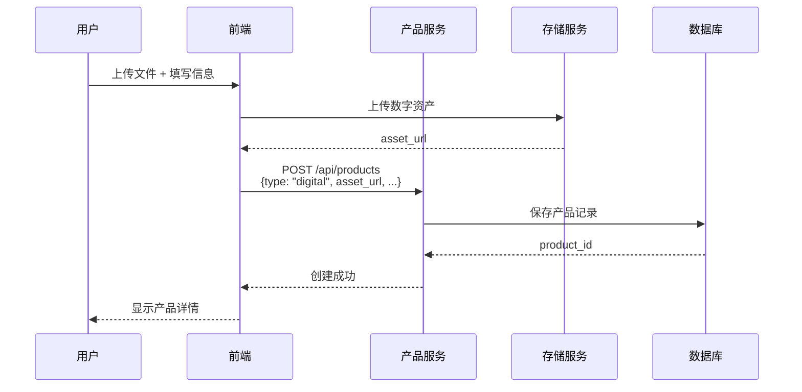
```mermaid
sequenceDiagram
    participant U as 用户
    participant F as 前端
    participant P as 产品服务
    participant S as 存储服务
    participant DB as 数据库
    
    U->>F: 上传文件 + 填写信息
    F->>S: 上传数字资产
    S-->>F: asset_url
    F->>P: POST /api/products<br/>{type: "digital", asset_url, ...}
    P->>DB: 保存产品记录
    DB-->>P: product_id
    P-->>F: 创建成功
    F-->>U: 显示产品详情
```

---

## 2. AI 生成流程

### 2.1 文生图流程

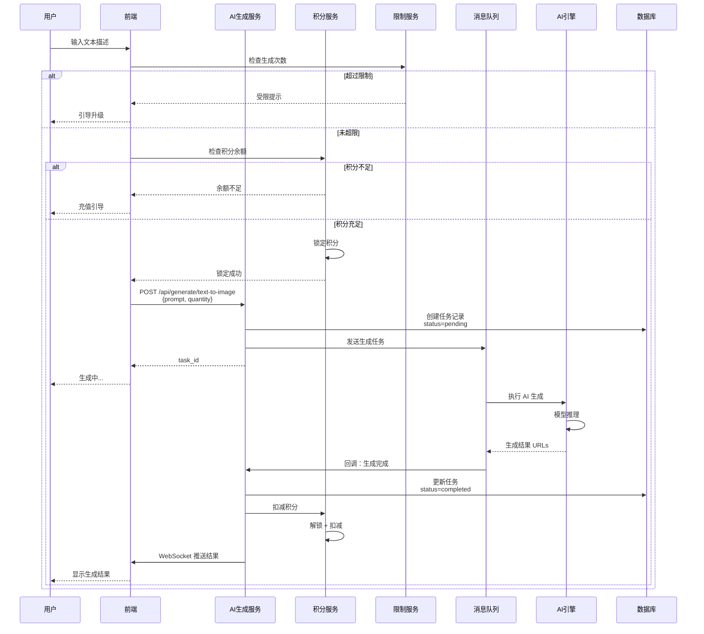
```mermaid
sequenceDiagram
    participant U as 用户
    participant F as 前端
    participant G as AI生成服务
    participant C as 积分服务
    participant L as 限制服务
    participant Q as 消息队列
    participant AI as AI引擎
    participant DB as 数据库
    
    U->>F: 输入文本描述
    F->>L: 检查生成次数
    
    alt 超过限制
        L-->>F: 受限提示
        F-->>U: 引导升级
    else 未超限
        F->>C: 检查积分余额
        
        alt 积分不足
            C-->>F: 余额不足
            F-->>U: 充值引导
        else 积分充足
            C->>C: 锁定积分
            C-->>F: 锁定成功
            
            F->>G: POST /api/generate/text-to-image<br/>{prompt, quantity}
            G->>DB: 创建任务记录<br/>status=pending
            G->>Q: 发送生成任务
            G-->>F: task_id
            F-->>U: 生成中...
            
            Q->>AI: 执行 AI 生成
            AI->>AI: 模型推理
            AI-->>Q: 生成结果 URLs
            
            Q->>G: 回调：生成完成
            G->>DB: 更新任务<br/>status=completed
            G->>C: 扣减积分
            C->>C: 解锁 + 扣减
            G->>F: WebSocket 推送结果
            F-->>U: 显示生成结果
        end
    end
```

### 2.2 图生图流程

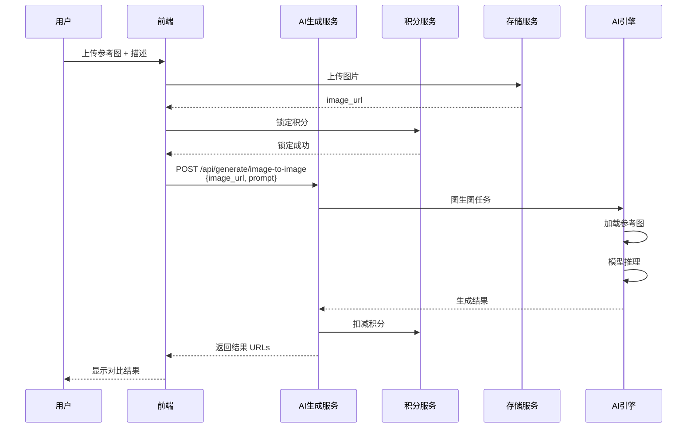
```mermaid
sequenceDiagram
    participant U as 用户
    participant F as 前端
    participant G as AI生成服务
    participant C as 积分服务
    participant S as 存储服务
    participant AI as AI引擎
    
    U->>F: 上传参考图 + 描述
    F->>S: 上传图片
    S-->>F: image_url
    
    F->>C: 锁定积分
    C-->>F: 锁定成功
    
    F->>G: POST /api/generate/image-to-image<br/>{image_url, prompt}
    G->>AI: 图生图任务
    AI->>AI: 加载参考图
    AI->>AI: 模型推理
    AI-->>G: 生成结果
    G->>C: 扣减积分
    G-->>F: 返回结果 URLs
    F-->>U: 显示对比结果
```

### 2.3 生成失败流程

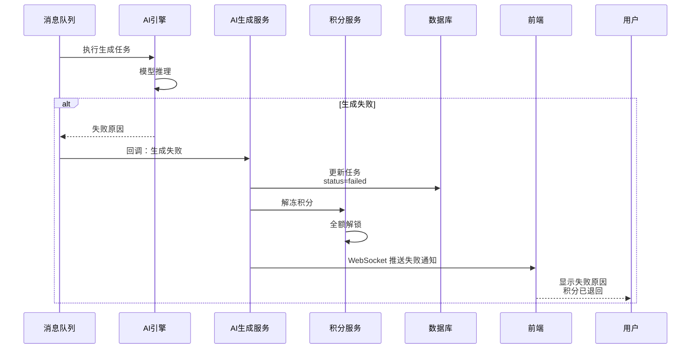
```mermaid
sequenceDiagram
    participant Q as 消息队列
    participant AI as AI引擎
    participant G as AI生成服务
    participant C as 积分服务
    participant DB as 数据库
    participant F as 前端
    
    Q->>AI: 执行生成任务
    AI->>AI: 模型推理
    
    alt 生成失败
        AI-->>Q: 失败原因
        Q->>G: 回调：生成失败
        G->>DB: 更新任务<br/>status=failed
        G->>C: 解冻积分
        C->>C: 全额解锁
        G->>F: WebSocket 推送失败通知
        F-->>用户: 显示失败原因<br/>积分已退回
    end
```

---

## 3. 积分管理流程

### 3.1 积分锁定与扣减

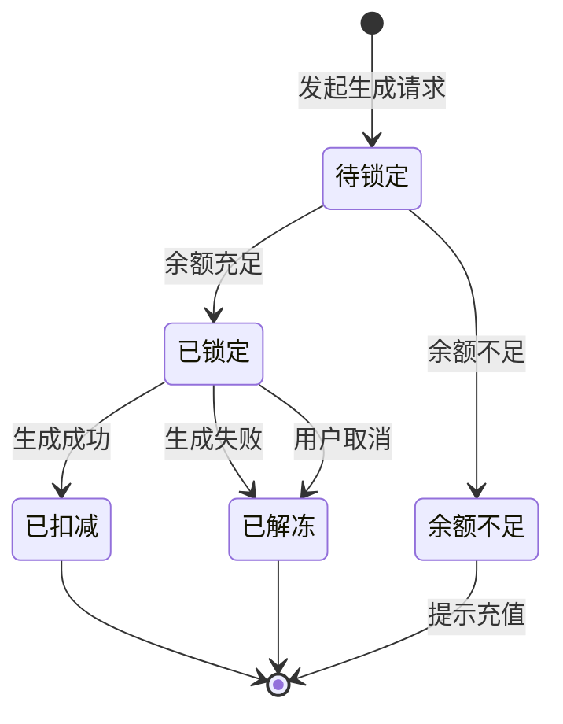
```mermaid
stateDiagram-v2
    [*] --> 待锁定: 发起生成请求
    
    待锁定 --> 已锁定: 余额充足
    待锁定 --> 余额不足: 余额不足
    
    已锁定 --> 已扣减: 生成成功
    已锁定 --> 已解冻: 生成失败
    已锁定 --> 已解冻: 用户取消
    
    已扣减 --> [*]
    已解冻 --> [*]
    余额不足 --> [*]: 提示充值
```

### 3.2 积分事务流程

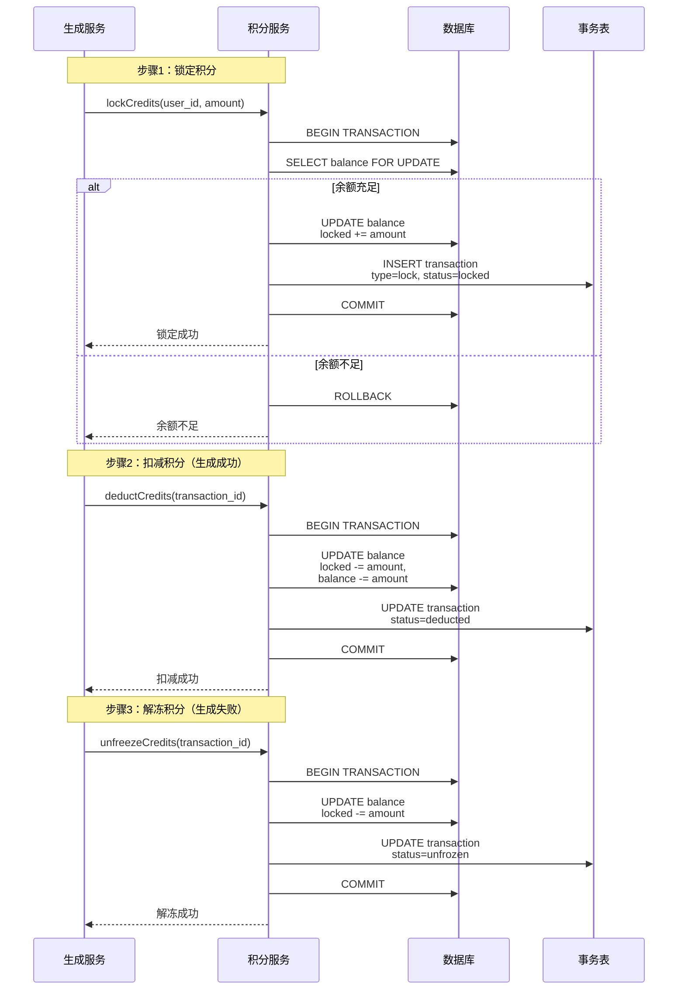
```mermaid
sequenceDiagram
    participant G as 生成服务
    participant C as 积分服务
    participant DB as 数据库
    participant T as 事务表
    
    Note over G,C: 步骤1：锁定积分
    G->>C: lockCredits(user_id, amount)
    C->>DB: BEGIN TRANSACTION
    C->>DB: SELECT balance FOR UPDATE
    
    alt 余额充足
        C->>DB: UPDATE balance<br/>locked += amount
        C->>T: INSERT transaction<br/>type=lock, status=locked
        C->>DB: COMMIT
        C-->>G: 锁定成功
    else 余额不足
        C->>DB: ROLLBACK
        C-->>G: 余额不足
    end
    
    Note over G,C: 步骤2：扣减积分（生成成功）
    G->>C: deductCredits(transaction_id)
    C->>DB: BEGIN TRANSACTION
    C->>DB: UPDATE balance<br/>locked -= amount,<br/>balance -= amount
    C->>T: UPDATE transaction<br/>status=deducted
    C->>DB: COMMIT
    C-->>G: 扣减成功
    
    Note over G,C: 步骤3：解冻积分（生成失败）
    G->>C: unfreezeCredits(transaction_id)
    C->>DB: BEGIN TRANSACTION
    C->>DB: UPDATE balance<br/>locked -= amount
    C->>T: UPDATE transaction<br/>status=unfrozen
    C->>DB: COMMIT
    C-->>G: 解冻成功
```

---

## 4. 限制与升级引导

### 4.1 限制检查流程

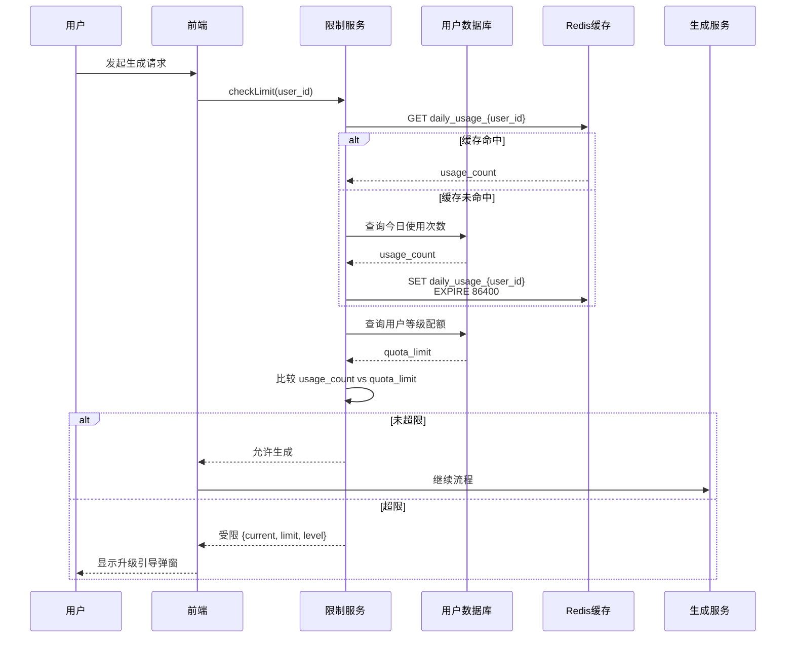
```mermaid
sequenceDiagram
    participant U as 用户
    participant F as 前端
    participant L as 限制服务
    participant DB as 用户数据库
    participant R as Redis缓存
    
    U->>F: 发起生成请求
    F->>L: checkLimit(user_id)
    
    L->>R: GET daily_usage_{user_id}
    
    alt 缓存命中
        R-->>L: usage_count
    else 缓存未命中
        L->>DB: 查询今日使用次数
        DB-->>L: usage_count
        L->>R: SET daily_usage_{user_id}<br/>EXPIRE 86400
    end
    
    L->>DB: 查询用户等级配额
    DB-->>L: quota_limit
    
    L->>L: 比较 usage_count vs quota_limit
    
    alt 未超限
        L-->>F: 允许生成
        F->>生成服务: 继续流程
    else 超限
        L-->>F: 受限 {current, limit, level}
        F-->>U: 显示升级引导弹窗
    end
```

### 4.2 升级引导流程

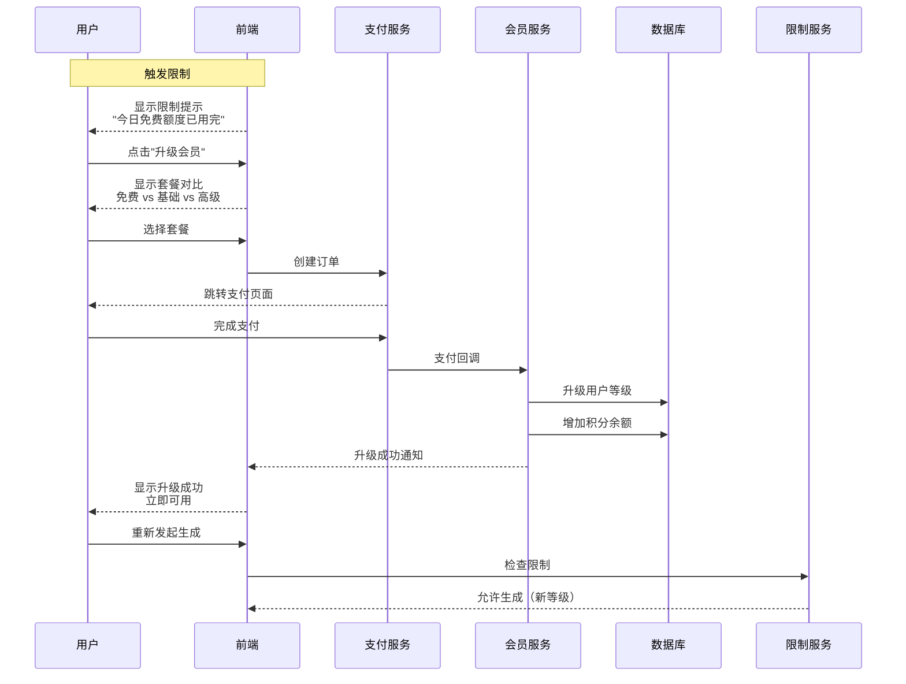
```mermaid
sequenceDiagram
    participant U as 用户
    participant F as 前端
    participant P as 支付服务
    participant M as 会员服务
    participant DB as 数据库
    
    Note over U,F: 触发限制
    F-->>U: 显示限制提示<br/>"今日免费额度已用完"
    
    U->>F: 点击"升级会员"
    F-->>U: 显示套餐对比<br/>免费 vs 基础 vs 高级
    
    U->>F: 选择套餐
    F->>P: 创建订单
    P-->>U: 跳转支付页面
    
    U->>P: 完成支付
    P->>M: 支付回调
    M->>DB: 升级用户等级
    M->>DB: 增加积分余额
    M-->>F: 升级成功通知
    
    F-->>U: 显示升级成功<br/>立即可用
    U->>F: 重新发起生成
    F->>限制服务: 检查限制
    限制服务-->>F: 允许生成（新等级）
```

---

## 5. DS 推荐流程（Dropshipping）

### 5.1 获取推荐产品

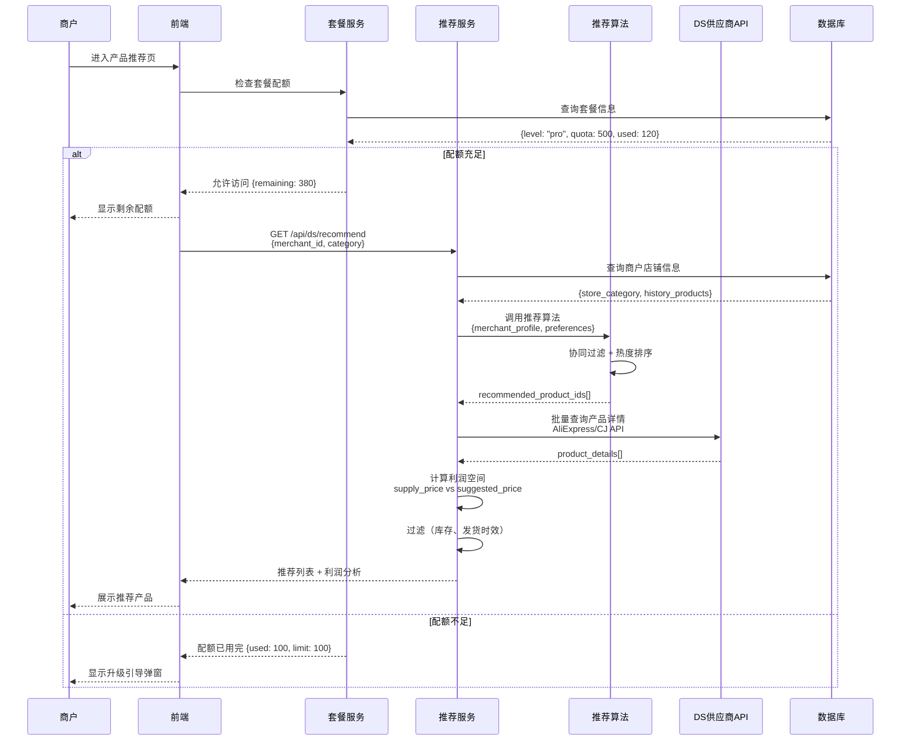
```mermaid
sequenceDiagram
    participant M as 商户
    participant F as 前端
    participant S as 套餐服务
    participant R as 推荐服务
    participant A as 推荐算法
    participant DS as DS供应商API
    participant DB as 数据库
    
    M->>F: 进入产品推荐页
    F->>S: 检查套餐配额
    
    S->>DB: 查询套餐信息
    DB-->>S: {level: "pro", quota: 500, used: 120}
    
    alt 配额充足
        S-->>F: 允许访问 {remaining: 380}
        F-->>M: 显示剩余配额
        
        F->>R: GET /api/ds/recommend<br/>{merchant_id, category}
        
        R->>DB: 查询商户店铺信息
        DB-->>R: {store_category, history_products}
        
        R->>A: 调用推荐算法<br/>{merchant_profile, preferences}
        A->>A: 协同过滤 + 热度排序
        A-->>R: recommended_product_ids[]
        
        R->>DS: 批量查询产品详情<br/>AliExpress/CJ API
        DS-->>R: product_details[]
        
        R->>R: 计算利润空间<br/>supply_price vs suggested_price
        R->>R: 过滤（库存、发货时效）
        R-->>F: 推荐列表 + 利润分析
        
        F-->>M: 展示推荐产品
    else 配额不足
        S-->>F: 配额已用完 {used: 100, limit: 100}
        F-->>M: 显示升级引导弹窗
    end
```

### 5.2 添加推荐产品到商户库

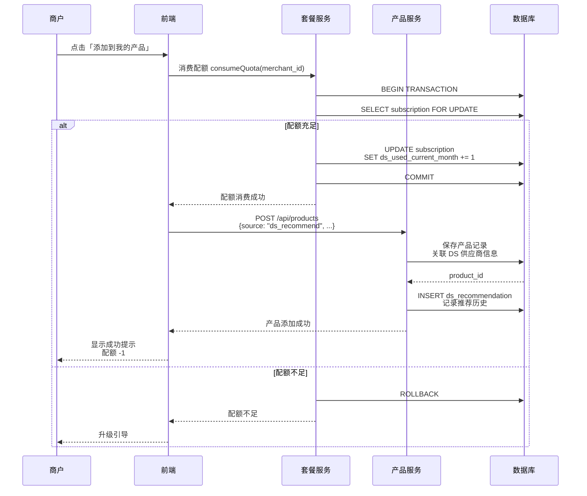
```mermaid
sequenceDiagram
    participant M as 商户
    participant F as 前端
    participant S as 套餐服务
    participant P as 产品服务
    participant DB as 数据库
    
    M->>F: 点击「添加到我的产品」
    F->>S: 消费配额 consumeQuota(merchant_id)
    
    S->>DB: BEGIN TRANSACTION
    S->>DB: SELECT subscription FOR UPDATE
    
    alt 配额充足
        S->>DB: UPDATE subscription<br/>SET ds_used_current_month += 1
        S->>DB: COMMIT
        S-->>F: 配额消费成功
        
        F->>P: POST /api/products<br/>{source: "ds_recommend", ...}
        P->>DB: 保存产品记录<br/>关联 DS 供应商信息
        DB-->>P: product_id
        
        P->>DB: INSERT ds_recommendation<br/>记录推荐历史
        P-->>F: 产品添加成功
        
        F-->>M: 显示成功提示<br/>配额 -1
    else 配额不足
        S->>DB: ROLLBACK
        S-->>F: 配额不足
        F-->>M: 升级引导
    end
```

### 5.3 配额重置（每月）

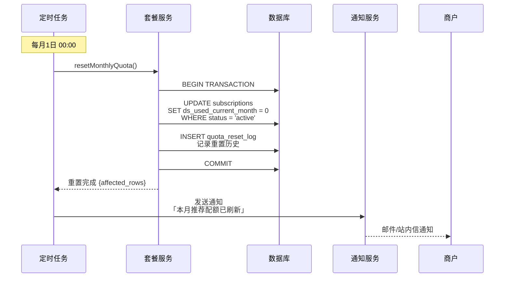
```mermaid
sequenceDiagram
    participant Scheduler as 定时任务
    participant S as 套餐服务
    participant DB as 数据库
    participant N as 通知服务
    
    Note over Scheduler: 每月1日 00:00
    
    Scheduler->>S: resetMonthlyQuota()
    S->>DB: BEGIN TRANSACTION
    
    S->>DB: UPDATE subscriptions<br/>SET ds_used_current_month = 0<br/>WHERE status = 'active'
    
    S->>DB: INSERT quota_reset_log<br/>记录重置历史
    
    S->>DB: COMMIT
    S-->>Scheduler: 重置完成 {affected_rows}
    
    Scheduler->>N: 发送通知<br/>「本月推荐配额已刷新」
    N-->>商户: 邮件/站内信通知
```

---

## 6. 批量生成流程

### 6.1 多数量生成

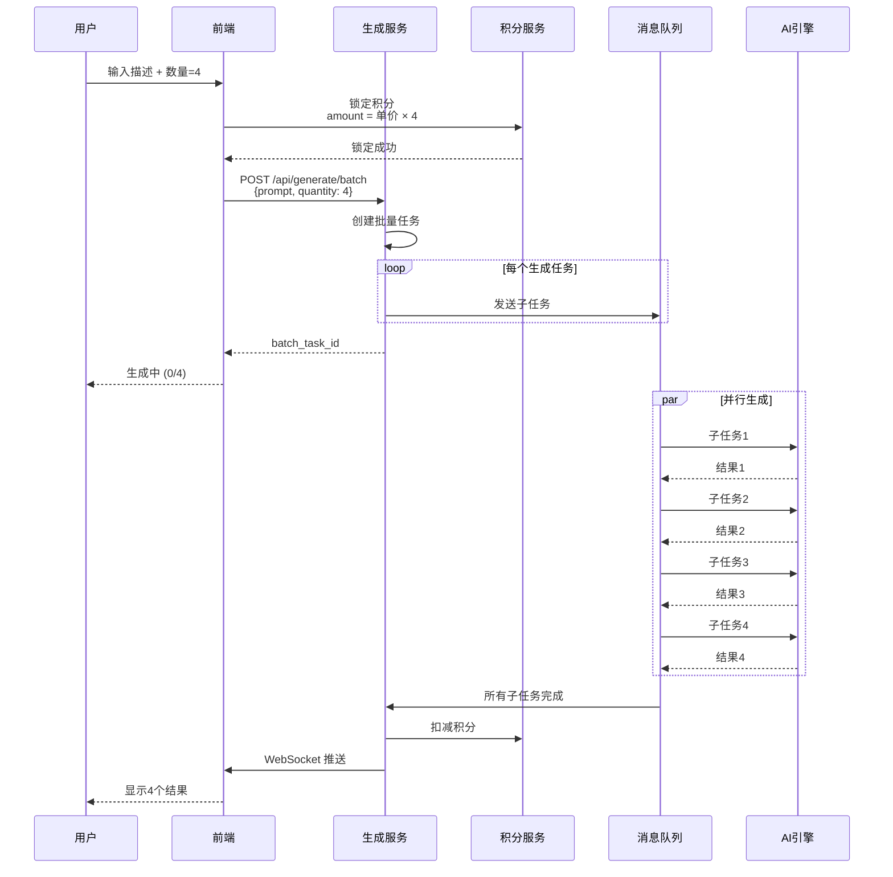
```mermaid
sequenceDiagram
    participant U as 用户
    participant F as 前端
    participant G as 生成服务
    participant C as 积分服务
    participant Q as 消息队列
    participant AI as AI引擎
    
    U->>F: 输入描述 + 数量=4
    F->>C: 锁定积分<br/>amount = 单价 × 4
    C-->>F: 锁定成功
    
    F->>G: POST /api/generate/batch<br/>{prompt, quantity: 4}
    G->>G: 创建批量任务
    
    loop 每个生成任务
        G->>Q: 发送子任务
    end
    
    G-->>F: batch_task_id
    F-->>U: 生成中 (0/4)
    
    par 并行生成
        Q->>AI: 子任务1
        AI-->>Q: 结果1
        Q->>AI: 子任务2
        AI-->>Q: 结果2
        Q->>AI: 子任务3
        AI-->>Q: 结果3
        Q->>AI: 子任务4
        AI-->>Q: 结果4
    end
    
    Q->>G: 所有子任务完成
    G->>C: 扣减积分
    G->>F: WebSocket 推送
    F-->>U: 显示4个结果
```

---

## 7. 异常处理流程

### 7.1 AI 生成超时

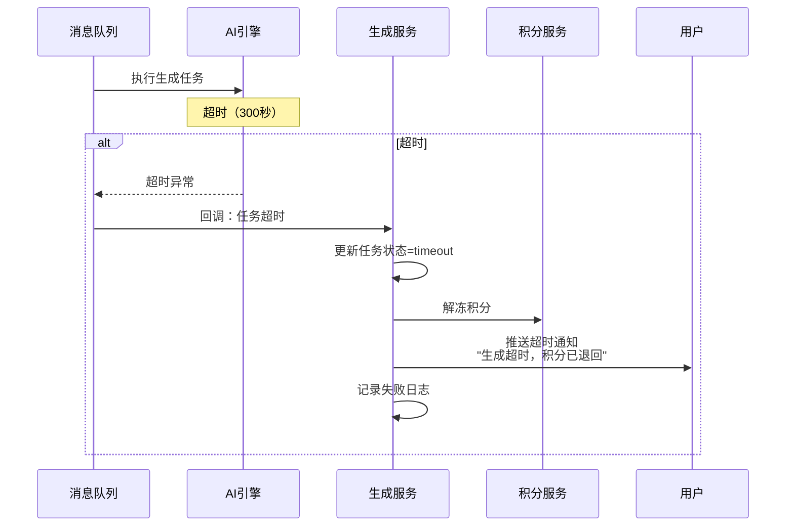
```mermaid
sequenceDiagram
    participant Q as 消息队列
    participant AI as AI引擎
    participant G as 生成服务
    participant C as 积分服务
    participant U as 用户
    
    Q->>AI: 执行生成任务
    
    Note over AI: 超时（300秒）
    
    alt 超时
        AI-->>Q: 超时异常
        Q->>G: 回调：任务超时
        G->>G: 更新任务状态=timeout
        G->>C: 解冻积分
        G->>U: 推送超时通知<br/>"生成超时，积分已退回"
        G->>G: 记录失败日志
    end
```

### 7.2 并发锁定冲突

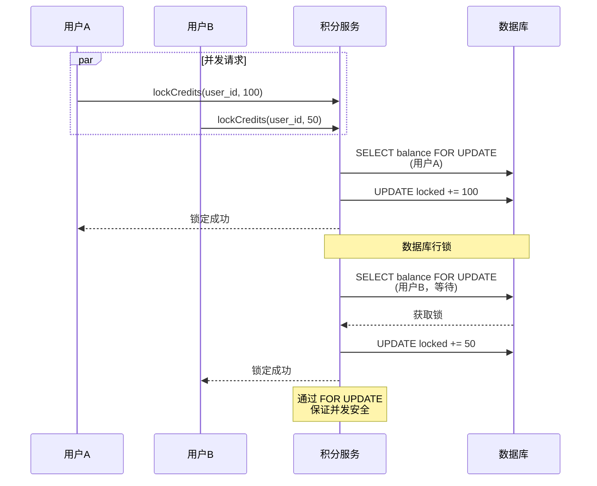
```mermaid
sequenceDiagram
    participant U1 as 用户A
    participant U2 as 用户B
    participant C as 积分服务
    participant DB as 数据库
    
    par 并发请求
        U1->>C: lockCredits(user_id, 100)
        U2->>C: lockCredits(user_id, 50)
    end
    
    C->>DB: SELECT balance FOR UPDATE<br/>(用户A)
    C->>DB: UPDATE locked += 100
    C-->>U1: 锁定成功
    
    Note over C,DB: 数据库行锁
    
    C->>DB: SELECT balance FOR UPDATE<br/>(用户B，等待)
    DB-->>C: 获取锁
    C->>DB: UPDATE locked += 50
    C-->>U2: 锁定成功
    
    Note over C: 通过 FOR UPDATE<br/>保证并发安全
```

---

## 流程设计要点

### 1. 幂等性保证
- 生成任务使用唯一 task_id
- 积分事务记录 transaction_id
- 支持重试不重复扣费

### 2. 事务一致性
- 积分操作使用数据库事务
- 锁定→扣减→解冻 状态机严格控制

### 3. 异步处理
- AI 生成异步执行
- WebSocket 实时推送进度
- 消息队列支持重试

### 4. 限流保护
- 用户级别限流（每日配额）
- API 级别限流（防刷）
- AI 引擎限流（防过载）

### 5. 降级策略
- AI 服务不可用时队列缓冲
- 推荐服务降级返回热门
- 积分服务异常时拒绝生成

---

**最后更新：** 2026-03-12
