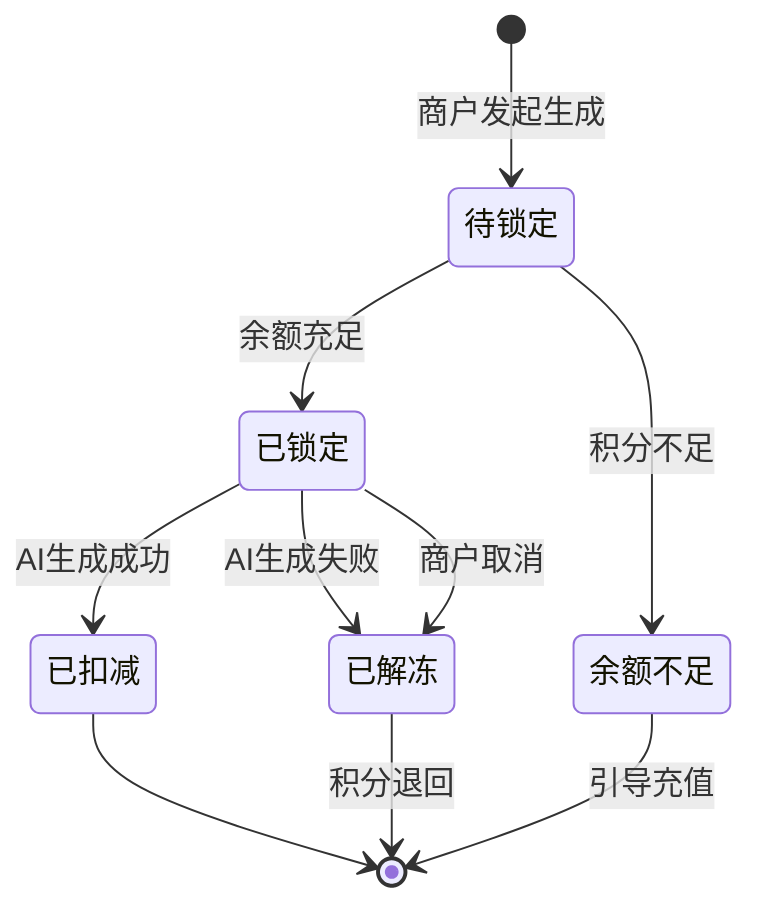
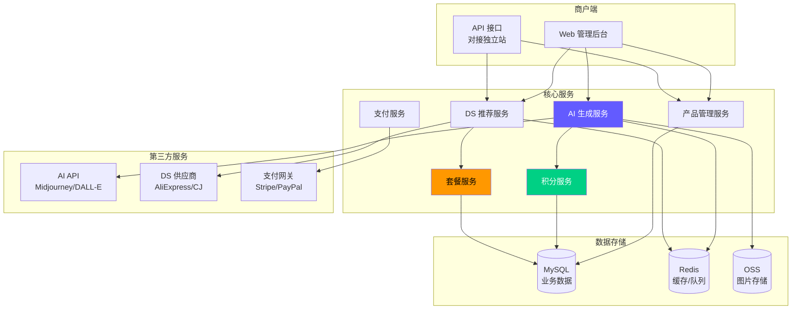
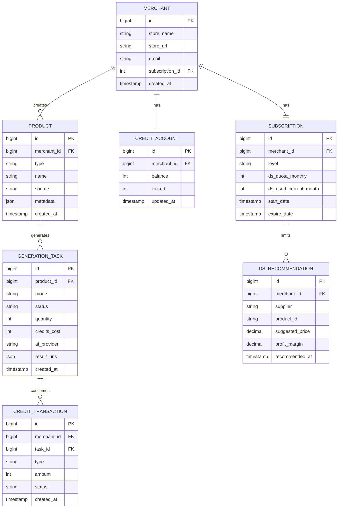

# 产品创建与AI生成管理系统

## 项目概述

为独立站商户提供产品创建、AI 图片生成及 Dropshipping 产品推荐能力的一站式平台。

## 业务背景

### 目标用户
**独立站商户（电商卖家）**
- 使用 Shopify / WooCommerce 等建站
- 需要快速上架商品
- 依赖 Dropshipping 模式（代发货）
- 需要高质量的产品图片

### 业务模式
- **积分制：** 商户购买积分包，消费积分使用服务
- **套餐制：** 不同套餐限制 DS 推荐产品数量
- **AI 生成：** 对接第三方 AI API（如 Midjourney、DALL-E）

### 核心价值
- 🎨 **AI 生成产品图**：文生图、图生图、图片增强
- 📦 **DS 产品推荐**：推荐热门 Dropshipping 产品
- 💰 **积分管理**：灵活的消费和充值机制
- 🚀 **快速上架**：一键同步到独立站

---

## 业务目标

1. **降低商户运营成本**
   - 无需自己拍摄商品图
   - AI 生成专业级产品图
   - 快速测试新品

2. **提升选品效率**
   - DS 推荐热门爆款
   - 套餐限制促进升级
   - 数据驱动选品

3. **实现可持续运营**
   - 积分消费模式
   - 套餐分层设计
   - 升级引导机制

---

## 核心功能模块

### 🎨 能力类型模块

#### 1. 产品创建
- **实物产品**：独立站销售的实体商品
- **数字产品**：虚拟商品（如设计稿、电子书）

#### 2. AI 图片生成（对接第三方 AI）
- **文生图**：从产品描述生成产品图（如"红色连衣裙，纯白背景"）
- **图生图**：基于参考图生成变体（如换颜色、换场景）
- **AI 增强**：提升图片质量（超分辨率、去背景）

**积分消费规则：**
- 文生图单张：10 积分
- 图生图单张：8 积分
- AI 增强单张：5 积分
- 批量生成：单价 × 数量

#### 3. 数量控制
- **单图生成**：一次生成 1 张
- **批量生成**：一次生成 4/8/16 张（提高选图概率）

#### 4. DS 推荐产品（Dropshipping）
**功能说明：**
- 从海外供应商（如 AliExpress、CJ Dropshipping）推荐热门产品
- 基于商户店铺类目、历史销售数据智能推荐
- 提供产品详情、利润分析、竞品分析

**套餐限制：**
| 套餐等级 | 每月推荐数量 | 价格 |
|---------|-------------|------|
| 免费版 | 10 个产品/月 | ¥0 |
| 基础版 | 100 个产品/月 | ¥99/月 |
| 专业版 | 500 个产品/月 | ¥299/月 |
| 企业版 | 无限制 | ¥999/月 |

---

### 💰 商业化模块

#### 1. 积分管理

##### 积分获取
- **购买积分包**
  - 100 积分：¥19.9
  - 500 积分：¥89（折扣 11%）
  - 1000 积分：¥159（折扣 20%）
  - 5000 积分：¥699（折扣 30%）

##### 积分消费流程

**锁定机制说明：**
1. **发起生成时**：立即锁定所需积分（防止余额不足）
2. **生成成功**：扣减积分并解锁
3. **生成失败**：全额解冻（第三方 AI 异常、超时等）

##### 积分有效期
- 充值积分：永久有效
- 赠送积分：90 天有效期

#### 2. 套餐管理（DS 推荐数量限制）

**套餐权益对比：**

| 功能 | 免费版 | 基础版 | 专业版 | 企业版 |
|------|--------|--------|--------|--------|
| **DS 推荐数量** | 10/月 | 100/月 | 500/月 | 无限制 |
| **AI 生成** | ✅ 积分消费 | ✅ 积分消费 | ✅ 积分消费 | ✅ 积分消费 |
| **生成优先级** | 普通 | 普通 | 高 | 最高 |
| **批量生成** | ❌ | ✅ 最多4张 | ✅ 最多16张 | ✅ 无限制 |
| **API 访问** | ❌ | ❌ | ✅ | ✅ |
| **专属客服** | ❌ | ❌ | ❌ | ✅ |

**注意：** AI 生成和 DS 推荐是独立计费
- AI 生成：消费积分（所有套餐都需要购买积分）
- DS 推荐：套餐配额（每月固定数量）

#### 3. 升级引导

**触发场景：**
1. **DS 推荐配额用完**
   - 提示：「本月推荐配额已用完，升级专业版可获得 500 个/月」
   - 引导：对比套餐权益，显示升级价格

2. **批量生成受限**
   - 提示：「当前套餐仅支持单图生成，升级基础版可批量生成 4 张」
   - 引导：展示批量生成的效率优势

3. **生成队列等待过长**
   - 提示：「当前队列较长，专业版用户可享受优先队列」
   - 引导：对比等待时间

---

## 系统架构

---

## 核心数据模型

---

## 关键业务场景

### 场景 1：商户生成产品图

1. 商户在后台创建新产品
2. 输入产品描述："红色连衣裙，白色背景，专业摄影"
3. 选择生成数量：4 张（消费 40 积分）
4. 系统锁定 40 积分
5. 调用第三方 AI API（Midjourney）
6. 生成完成，扣减积分，展示 4 张结果
7. 商户选择满意的图片，关联到产品
8. 一键同步到独立站

### 场景 2：商户查看 DS 推荐

1. 商户进入「产品推荐」页面
2. 系统检查套餐配额（专业版：500/月，已用 120）
3. 基于商户店铺类目（女装）推荐热门产品
4. 展示推荐产品：
   - 产品详情（图片、描述、价格）
   - 利润分析（供应商价 vs 建议售价）
   - 竞品分析（销量、评价）
5. 商户点击「添加到我的产品」
6. 使用 1 个推荐配额（剩余 379）
7. 产品导入成功

### 场景 3：配额用尽引导升级

1. 商户查看推荐时，配额已用完（100/100）
2. 系统弹窗：
   - 「本月推荐配额已用完」
   - 「升级到专业版可获得 500 个/月，仅需 ¥299」
3. 展示套餐对比表
4. 商户点击「立即升级」
5. 跳转支付页面
6. 完成支付，套餐升级成功
7. DS 配额立即刷新为 500

---

## 技术栈

### 后端
- **语言：** Java 17 / Python 3.10
- **框架：** Spring Boot 3.x
- **数据库：** MySQL 8.0 + Redis 7.x
- **消息队列：** RabbitMQ（AI 生成任务）

### 前端
- **框架：** React 18 + TypeScript
- **UI 库：** Ant Design Pro
- **状态管理：** Redux Toolkit

### 第三方集成
- **AI 服务：** Midjourney API / DALL-E 3 / Stable Diffusion API
- **DS 供应商：** AliExpress API / CJ Dropshipping API
- **支付：** Stripe / PayPal / 支付宝

---

## 文档导航

- [系统架构详解](architecture/overview.md)
- [核心流程设计](architecture/workflows.md)
- [API 接口文档](api/rest-api.md)
- [部署运维指南](guides/deployment.md)

---

**项目负责人：** zhengfang  
**最后更新：** 2026-03-12  
**目标用户：** 独立站商户（Dropshipping 电商卖家）
